# Web API集成发布服务

## 产品概述

本产品是一个基于数据库集成的Web API服务，提供四个主要功能：
1. **SQL执行引擎**：安全的代理执行SQL增删改查并返回标准结构数据
2. **WebService代理服务**：代理调用SOAP WebService并处理响应返回标准结构数据
3. **WebAPI代理服务**：代理调用REST API并处理响应返回标准结构数据
4. **API接口发布服务**：提供 GET/POST/SOAP 三种API方式发布接口


### 使用场景：
1、扩展MSSQL数据库不依赖链接服务器，直接调用其他类型数据库（SQL Server、MySQL、Oracle、PostgreSQL等）的能力。  
2、扩展MSSQL数据库调用WebService/WebAPI服务的能力。  
3、扩展数据库发布WEB接口的能力，将存储过程转换成GET/POST/SOAP 三种方式的API供调用。 

#### 配合MSSQL调用的CLR组件 【SqlEngineIntegration】

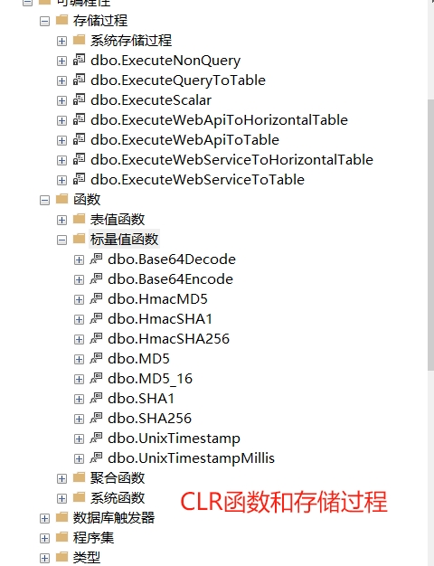

### 部署说明

1、windows直接运行或注册成服务，需要windows2012及以上版本。  
2、mssql上访问其他数据库或WebService/WebAPI，需要注册配套的CLR组件。【SqlEngineIntegration】  
3、服务需要授权【license.txt】才能运行。  
4、支持linux，使用docker部署。  


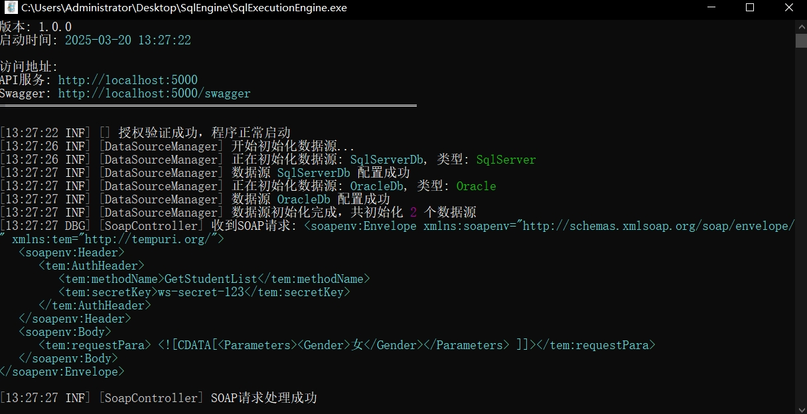

### 配置说明
```json
{
  "LogSettings": {
    "MinimumLevel": "debug",  //日志级别 目前支持debug、info、warn、error、fatal
    "RetainedDays": 7        //日志保留天数 
  },
  "AllowedHosts": "*",       //允许访问的主机
  "Urls": "http://localhost:5000", //监听地址
  "EnableSwagger": true,     //启用Swagger
  "ApiKey": "your-secret-api-key-here", //API密钥,访问SqlExecution/WebService/WebApiProxy 接口的密钥
  "DataSources": {
    "Name": "MySqlDb", //数据源名称
    "ConnectionString": "Server=localhost;Port=3306;Database=testdb;User=root;Password=password;", //数据库连接字符串
    "DbType": "MySql", //数据库类型 目前支持MySql、SqlServer、Oracle、PostgreSQL
    "IsEnabled": false, //是否启用
    "Description": "MySQL测试数据库" //数据库描述
  }
}
```


#### 常用数据库连接字符串
```
MySql： Data Source=127.0.0.1;Port=3306;User ID=root;Password=root; Initial Catalog=cccddd;Charset=utf8mb4; SslMode=none;Min pool size=1
SqlServer： Data Source=.;User Id=sa;Password=123456;Initial Catalog=freesqlTest;Encrypt=True;TrustServerCertificate=True;Pooling=true;Min Pool Size=1
Oracle： user id=user1;password=123456; data source=//127.0.0.1:1521/XE;Pooling=true;Min Pool Size=1
PostgreSQL： Host=192.168.164.10;Port=5432;Username=postgres;Password=123456; Database=tedb;ArrayNullabilityMode=Always;Pooling=true;Minimum Pool Size=1
```

```json
{
  "GetDataApi": {},  //GET方式api的配置
  "PostDataApi": {}, //POST方式api的配置
  "SoapDataApi": {   //SOAP方式api的配置
    "Methods": {
      "Name": "GetStudentList", //方法名称 对应存储过程名称
      "DataSourceName": "SqlServerDb", //数据源名称 对应DataSources中的Name
      "Description": "获取学生列表", //方法描述
      "SecretKey": "sql-server-secret-123" //密钥 访问该方法的密钥
    }
  }
}
```


### 使用说明

#### SQL代理执行服务

1、都是POST请求，请求头需要添加X-API-Key，值为配置的ApiKey。  
2、POST /api/SqlExecution/execute  执行返回集合数据的SQL语句 如select * from users  
3、POST /api/SqlExecution/executeScalar  执行返回单个值的SQL语句 如select count(*) from users  
4、POST /api/SqlExecution/executeNonQuery  执行非查询操作的SQL语句 如update users set status=1 where id=1  
5、parameters为参数化查询的参数，参数名称为SQL语句中的参数名称，参数值为参数的值。  

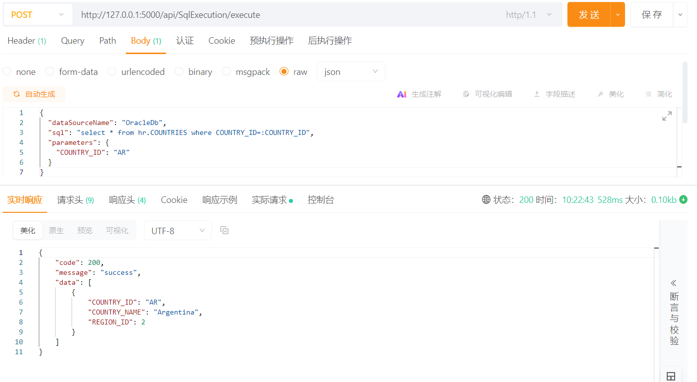
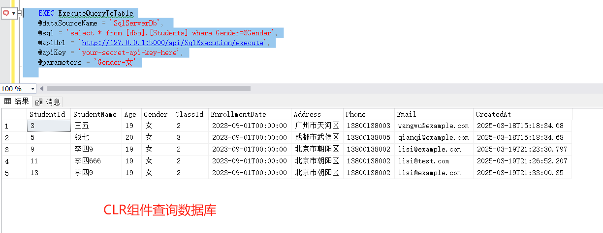


请求体例子：
注意：sql语句种的参数需要根据数据库类型使用不同的语法，如Oracle需要使用:参数名,SqlServer/MySQL/其他需要使用@参数名。也可以不使用参数化查询，直接在sql语句中写死参数值。

```
{
  "dataSourceName": "OracleDb",
  "sql": "select * from hr.COUNTRIES where COUNTRY_ID=:COUNTRY_ID",
  "parameters": {
    "COUNTRY_ID": "AR"
  }
}

```
**响应格式**
   ```json
   {
     "code": 200,
     "message": "success",
     "data": [
       {
         "StudentName": "张三",
         "Age": "18"
       }
     ]
   }
   ```
   

#### WebService代理调用服务

1、POST /api/WebServiceProxy/call  
2、调用本地测试文件路径格式serviceUrl为file://C:\\Users\\Administrator\\Desktop\\testxml\\test.xml  
3、调用远程WebService服务格式serviceUrl为http://ws.webxml.com.cn/WebServices/MobileCodeWS.asmx  
4、requestXmlBase64为SOAP请求XML的Base64编码，xPath为提取数据的XPath路径。  
5、soapAction通过wsdl获得。  
6、soap接口验证一般是在请求体里，如有验证直接放requestXmlBase64里。  

##### XPath 用法（WebService）
用于从 SOAP XML 响应中提取数据：

```
1. 基本语法：
   - /Student          # 提取Student节点
   - //Student         # 在任意位置查找Student节点
   - /Student/name     # 提取Student下的name节点

2. 常见用例：
   - /Student/patientName     # 提取学生姓名列表
   - //Subject/Name           # 提取所有科目名称
   - /Student                 # 提取完整的学生信息（自动展平）

3. 返回格式：
   - 叶子节点：[{"patientName": "张三"}, {"patientName": "李四"}]
   - 复杂节点：自动展平为表格结构
```

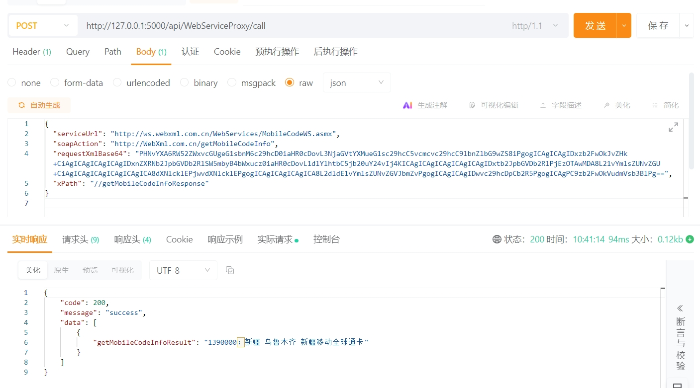
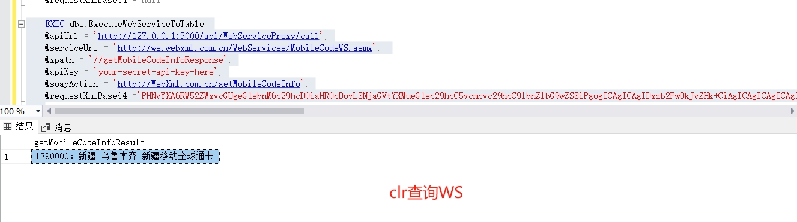


请求体例子：
```
{
  "serviceUrl": "http://ws.webxml.com.cn/WebServices/MobileCodeWS.asmx",
  "soapAction": "http://WebXml.com.cn/getMobileCodeInfo",
  "requestXmlBase64": "PHNvYXA6RW52ZWxvcGUgeG1sbnM6c29hcD0iaHR0cDovL3NjaGVtYXMueG1sc29hcC5vcmcvc29hcC9lbnZlbG9wZS8iPgogICAgICAgIDxzb2FwOkJvZHk+CiAgICAgICAgICAgIDxnZXRNb2JpbGVDb2RlSW5mbyB4bWxucz0iaHR0cDovL1dlYlhtbC5jb20uY24vIj4KICAgICAgICAgICAgICAgIDxtb2JpbGVDb2RlPjEzOTAwMDA8L21vYmlsZUNvZGU+CiAgICAgICAgICAgICAgICA8dXNlcklEPjwvdXNlcklEPgogICAgICAgICAgICA8L2dldE1vYmlsZUNvZGVJbmZvPgogICAgICAgIDwvc29hcDpCb2R5PgogICAgPC9zb2FwOkVudmVsb3BlPg==",
  "xPath": "//getMobileCodeInfoResponse"
}

本地测试：
{
  "serviceUrl": "file://C:\\Users\\Administrator\\Desktop\\testxml\\test.xml",
  "soapAction": "",
  "requestXmlBase64": "",
  "xPath": "//Student/patientName"
}
```
**响应格式**
   ```json
   {
     "code": 200,
     "message": "success",
     "data": [
       {
         "StudentName": "张三",
         "Age": "18"
       }
     ]
   }
   ```

#### WebAPI代理调用服务

1、POST /api/WebApiProxy/call  
2、调用本地测试文件路径格式serviceUrl为file://C:\\Users\\Administrator\\Desktop\\testjson\\test.json  
3、调用远程WebAPI服务格式serviceUrl为http://jsonplaceholder.typicode.com/posts  
4、method为请求方法，如GET、POST、PUT、DELETE等。  
5、headers为请求头，如Authorization、Content-Type等。  
6、queryParams为请求参数，如class、grade等。主要用于GET请求，如果 URL 是 http://api.example.com/students，且 queryParams 包含 {"class": "1", "grade": "2"}最终生成的 URL 会变成：http://api.example.com/students?class=1&grade=2  
7、bodyBase64为请求体Base64编码。主要用于POST、PUT、DELETE请求。  
8、jpath为提取数据的JPath路径。  
9、不需要的参数不要传，以免解析出错！  

###### JPath 用法（WebAPI）

用于从 JSON 响应中提取数据：

```
1. 基本语法：
   - $.students           # 获取students数组
   - $.students[0]        # 获取第一个学生
   - $.students[*].name   # 获取所有学生的名字
   - $..name             # 获取所有name字段

2. 常见用例：
   - $.students[*].scores[*]   # 提取所有成绩
   - $.students[?(@.age>20)]   # 筛选年龄大于20的学生
   - $..subject               # 提取所有科目

3. 返回格式：
   - 对象：转换为单行数据
   - 数组：每个元素转换为一行
   - 简单值：转换为单值字典
```

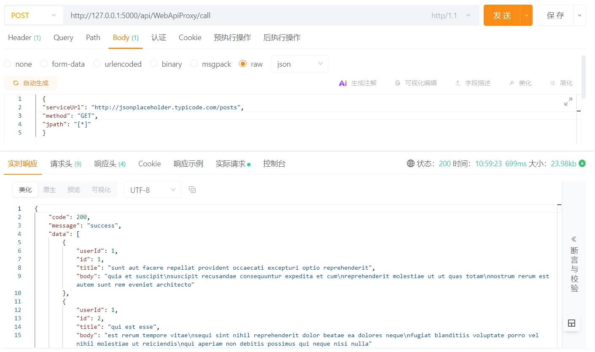
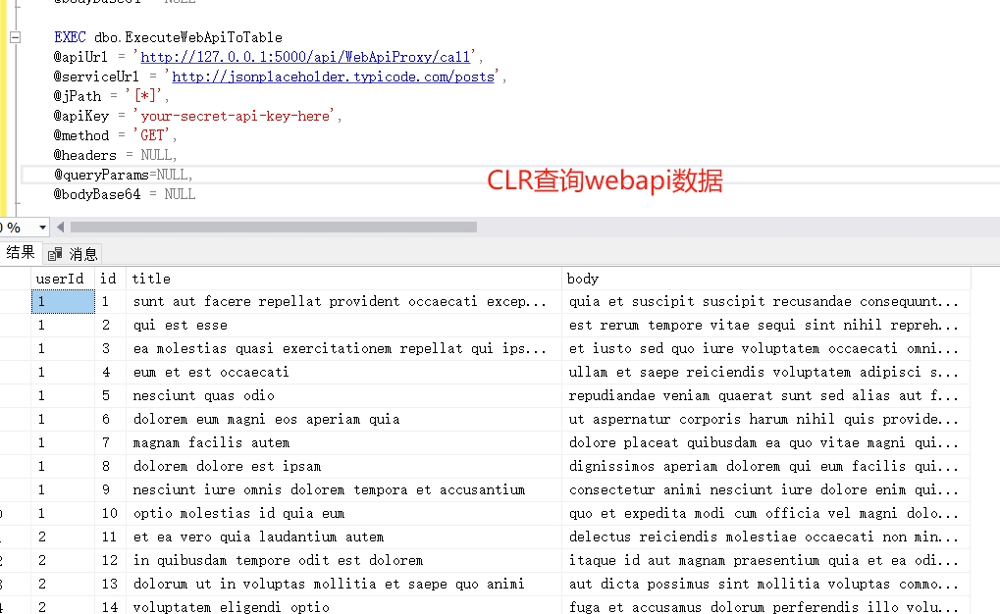
请求体例子：
```
  {
  "serviceUrl": "http://jsonplaceholder.typicode.com/posts",
  "method": "GET",
  "jpath": "[*]"
  }
本地测试：
  {
  "serviceUrl": "file://C:\\Users\\Administrator\\Desktop\\testxml\\test.json",
  "method": "GET",
  "jPath": "Students[*]"
}
```
POST请求发送JSON数据

```
{
  "serviceUrl": "https://api.example.com/users",
  "method": "POST",
  "headers": {
    "Content-Type": "application/json",
    "Authorization": "Bearer your-token-here"
  },
  "bodyBase64": "eyJuYW1lIjoiSm9obiBEb2UiLCJlbWFpbCI6ImpvaG5AZXhhbXBsZS5jb20ifQ==",
  "jPath": "$.id"
}
```

带查询参数的GET请求

```
{
  "serviceUrl": "https://api.example.com/search",
  "method": "GET",
  "queryParams": {
    "q": "keyword",
    "page": "1",
    "limit": "10"
  },
  "jPath": "$.results[*]"
}
```
**响应格式**
   ```json
   {
     "code": 200,
     "message": "success",
     "data": [
       {
         "StudentName": "张三",
         "Age": "18"
       }
     ]
   }
   ```

#### WEBAPI发布服务

1、GET方式  /api/GetData/方法名称?参数1=值1&参数2=值2 如/api/GetData/GetStudentList?secretKey=sql-server-secret-123&class=1&grade=2  这种方式只支持查询数据，密钥和条件全部在url中拼接。  
2、POST方式 /api/PostData/方法名称 如/api/PostData/InsertStudent 这种方式支持查询、插入、更新、删除数据。  
3、对应方式的方法名称对应appsettings.json中的Methods.Name 即数据源中存储过程名（注意大小写一致）  
5、POST请求体为json格式，参数为存储过程的参数，参数名称和类型需要和存储过程一致。  
6、POST请求体数据需要是扁平化数据，不要嵌套。  
7、POST请求只支持单行数据，需要插入或更新多行的需要请求多次实现！  
8、POST请求 请求头中需要包含X-Secret-Key，值为appsettings.json中的Methods.SecretKey  

#### GET 接口

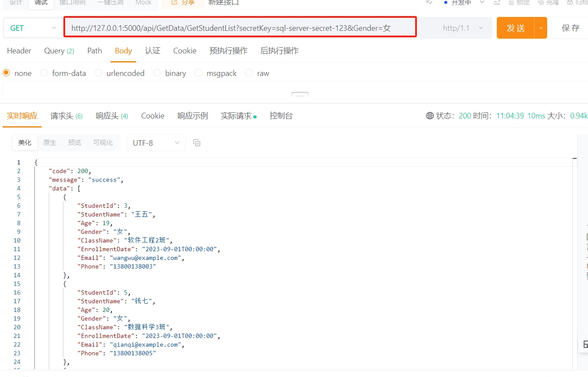
通过 URL 查询参数调用存储过程：

```
GET /api/GetData/{method}?secretKey=your-secret&param1=value1&param2=value2
```

示例：
```
GET /api/GetData/GetStudentList?secretKey=sql-server-secret-123&ClassId=2&Gender=男
```

响应：
```json
{
  "code": 200,
  "message": "success",
  "data": [
    {
      "StudentId": 1,
      "StudentName": "张三",
      "Age": 20,
      "Gender": "男",
      "ClassName": "高三一班",
      "EnrollmentDate": "2021-09-01",
      "Email": "zhangsan@example.com"
    }
  ]
}
```

#### POST 接口

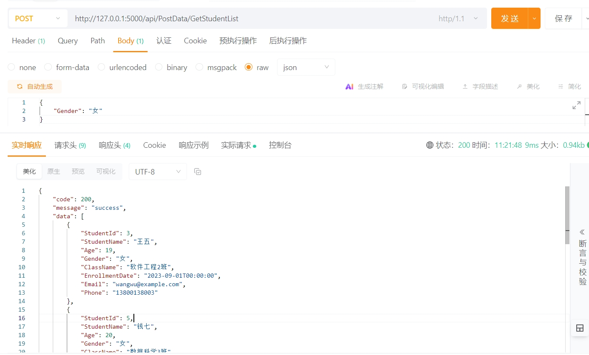

通过请求体传递参数调用存储过程：

```
POST /api/PostData/{method}
X-Secret-Key: your-secret

{
  "param1": "value1",
  "param2": "value2"
}
```

示例：
```
POST /api/PostData/GetStudentList
X-Secret-Key: sql-server-secret-123

{
  "ClassId": 2,
  "Gender": "男"
}
```

响应：
```json
{
  "code": 200,
  "message": "success",
  "data": [
    {
      "StudentId": 1,
      "StudentName": "张三",
      "Age": 20,
      "Gender": "男",
      "ClassName": "高三一班",
      "EnrollmentDate": "2021-09-01",
      "Email": "zhangsan@example.com"
    }
  ]
}
```


#### SOAP发布服务

1、/ws/soapservice.asmx  浏览器直接打开或加上?wsdl可以看到wsdl描述文件。接口支持查询、插入、更新、删除数据。  
2、requestPara请求体为xml格式，使用CDATA包裹。XML根路径必须是Parameters包裹。  
3、请求体数据需要是扁平化数据，不要嵌套。  
4、只支持单行数据，需要插入或更新多行的需要请求多次实现！  
5、请求头中的tem:secretKey，值为appsettings.json中的Methods.SecretKey  
6、请求头中的tem:methodName，值为appsettings.json中的Methods.Name 即数据源中存储过程名（注意大小写一致）  

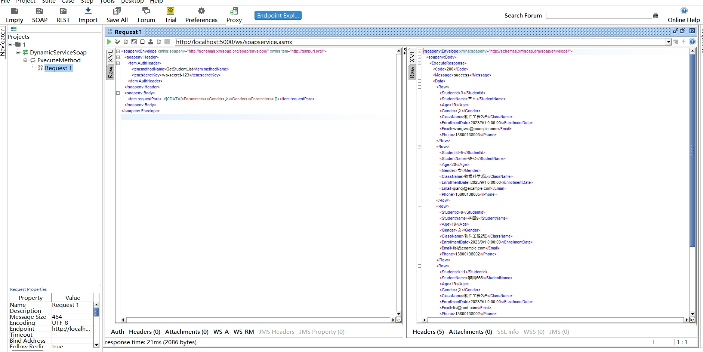
**接口说明**
   - WSDL地址：`/ws/soapservice.asmx` 或 `/ws/soapservice.asmx/wsdl`
   - 支持的操作：ExecuteMethod（执行存储过程）
   - Content-Type：text/xml

**认证方式**
   ```xml
   <soap:Header>
     <tem:AuthHeader>
       <tem:methodName>存储过程名称</tem:methodName>
       <tem:secretKey>访问密钥</tem:secretKey>
     </tem:AuthHeader>
   </soap:Header>
   ```

**请求格式**
   ```xml
   <soap:Envelope xmlns:soap="http://schemas.xmlsoap.org/soap/envelope/">
     <soap:Header>
       <tem:AuthHeader>
         <tem:methodName>InsertStudent</tem:methodName>
         <tem:secretKey>ws-secret-123</tem:secretKey>
       </tem:AuthHeader>
     </soap:Header>
     <soap:Body>
       <tem:requestPara>
         <![CDATA[
           <Parameters>
             <StudentName>张三</StudentName>
             <Age>18</Age>
             <Gender>男</Gender>
             <ClassId>2</ClassId>
           </Parameters>
         ]]>
       </tem:requestPara>
     </soap:Body>
   </soap:Envelope>
   ```

**响应格式**
   ```xml
   <soap:Envelope xmlns:soap="http://schemas.xmlsoap.org/soap/envelope/">
     <soap:Body>
       <ExecuteResponse>
         <Code>200</Code>
         <Message>success</Message>
         <Data>
           <Row>
             <StudentId>1</StudentId>
             <StudentName>张三</StudentName>
             <Age>18</Age>
           </Row>
         </Data>
       </ExecuteResponse>
     </soap:Body>
   </soap:Envelope>
   ```


## 功能特性

### SQL执行引擎

- 支持执行SQL查询、非查询操作和标量查询
- 支持多种执行方式：
  - ExecuteQuery：返回结果集
    ```sql
    -- 适用于需要多行多列数据的查询
    SELECT id, name, age FROM students WHERE class_id = @classId
    ```
  
  - ExecuteNonQuery：执行更新/删除操作
    ```sql
    -- 适用于INSERT/UPDATE/DELETE操作
    UPDATE students SET status = 'Active' WHERE id = @id
    DELETE FROM temp_data WHERE create_time < @date
    ```
  
  - ExecuteScalar：返回单个值
    ```sql
    -- 适用场景：
    -- 1. 获取计数
    SELECT COUNT(*) FROM students WHERE status = 'Active'
    -- 2. 获取聚合值
    SELECT SUM(amount) FROM orders WHERE order_date = @date
    -- 3. 检查存在性
    SELECT 1 FROM users WHERE username = @username
    -- 4. 获取新插入的ID
    INSERT INTO students (name) VALUES (@name); SELECT SCOPE_IDENTITY()
    ```

- 支持多种数据库（SQL Server、MySQL、Oracle、PostgreSQL等）
- 结果集转换为JSON格式
- 完整的错误处理和日志记录
- 支持事务管理
- 支持参数化查询，防止SQL注入

### WebService代理服务
- 支持SOAP WebService调用
- 支持读写操作：
  - 读取：XPath提取响应数据
  - 写入：发送SOAP请求XML
- 使用Base64编码处理XML请求和响应
- 将嵌套XML结构展平为表格数据
- 支持文件URL测试模式
- 全面的错误处理和日志记录
- 支持自定义SOAP头和SOAP操作

### WebAPI代理服务

- 支持所有HTTP方法（GET、POST、PUT、DELETE等）
- 支持读写操作：
  - 读取：GET请求 + JPath提取
  - 写入：POST/PUT/DELETE + 请求体
- 处理请求头、查询参数和请求体
- 使用JPath提取和处理JSON响应数据
- 将嵌套JSON结构展平为表格数据
- 支持文件URL测试模式
- 支持自定义HTTP头和超时设置

### API接口发布服务
- 支持三种调用方式：
  - GET接口：通过URL参数调用存储过程，适合查询操作
  - POST接口：通过请求体传递参数，支持增删改查操作
  - SOAP接口：标准WebService方式，支持增删改查操作
- 统一的认证机制：
  - GET方式：secretKey作为URL参数
  - POST方式：X-Secret-Key请求头
  - SOAP方式：AuthHeader中的secretKey
- 数据处理特性：
  - 支持扁平化数据结构
  - 自动类型转换
  - 参数验证和错误处理
- 安全特性：
  - 方法级别的密钥验证
  - 数据源隔离
  - 参数化处理防注入
- 配置灵活：
  - 支持多数据源配置
  - 方法级别的访问控制
  - 详细的日志记录
